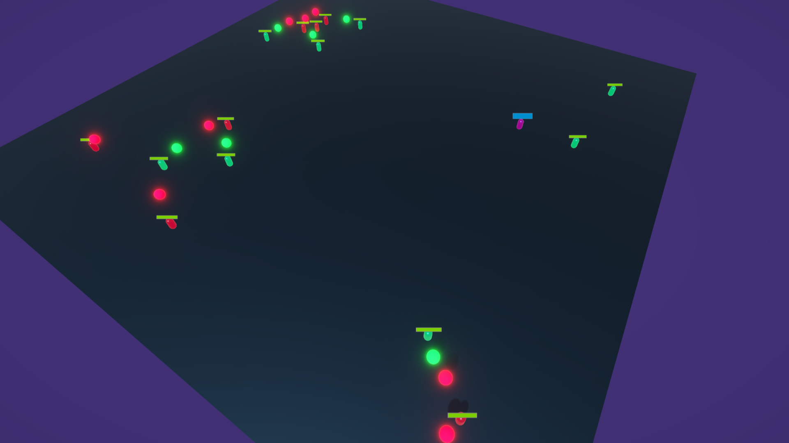

# Goblin State Machine for Unity

This is a lightweight, flexible state machine system for Unity, built around `ScriptableObject`-based states and predicates. Designed for AI characters, bots, enemies, and other brain-dead units that need clear behavior switching with reusable logic and clean runtime data separation.

The system promotes good architecture by separating:

- **States** – logic for what an entity should do (roaming, shooting, searching)
- **Predicates** – logic for *when* a state should change (conditions)
- **Transitions** – connections between states with logic conditions and priority
- **Blackboards** – entities' brains containing `Settings` (shared config) and `Data` (per-instance runtime data)

## Features

- Scriptable states and predicates: create reusable logic blocks with no MonoBehaviour dependencies
- Clean, readable transition system: priority-based with optional entry conditions
- Blackboard pattern with generics: strong typing for entity-specific behavior
- Plug-and-play design: easy to extend or embed in your own bot/AI system
- Zero dependencies: no third-party packages or plugins

## Example Scene

The package includes a working **example scene** with basic AI agents:

- One or more entities roam around the scene
- When a valid target enters detection range, they switch to search or shooting state
- Enemies die (and respawn, if you add that), and state transitions adapt accordingly

This scene shows how to:

- Set up a blackboard and connect it to a state machine
- Configure states and transitions using ScriptableObjects
- Handle AI movement with `NavMeshAgent`
- Debug transitions using logs

## Usage

1. Create your own Blackboard class by extending `StateMachineBlackboard<TSettings, TData>`
2. Implement states and predicates by extending `AbsStateSo<T>` and `AbsPredicateSo<T>`
3. Set up an `AbsStateMachine<TBlackboard>` component on a GameObject with transitions and entry state
4. Populate settings and data references via the inspector or script

The system is highly modular and suitable for:

- Enemy AI
- Patrol bots
- Ambient animal behaviors
- Utility-based decision logic

## License

This project is released into the public domain. See [UNLICENSE](Unlicense.txt) for details.

## Disclaimer

This project is maintained under the `CloudMedia` namespace and folder structure because it was developed by the CloudMedia team.
Attribution is not required, but feel free to credit CloudMedia if you find it useful.
